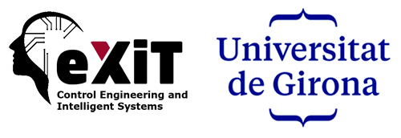

# Sobre el Projecte

Aquesta documentació detalla el funcionament intern i l'API de **ExitOS**, un sistema avançat de gestió energètica desenvolupat pel grup de recerca eXiT.

## El Grup de Recerca eXiT

El grup **eXiT** (Enginyeria de Control i Sistemes Intel·ligents) és un grup de recerca interdisciplinari vinculat a l'[Institut d’Informàtica i Aplicacions](http://iiia.udg.edu/) (IIiA) de la **Universitat de Girona (UdG)**.

L'activitat principal del grup se centra en el desenvolupament de solucions innovadores basades en la **Intel·ligència Artificial** per al control i la planificació de processos complexos. Amb una sòlida trajectòria en transferència tecnològica, el grup està acreditat amb el segell **TECNIO** de la Generalitat de Catalunya.

    

### Línies de Recerca Principals

    

        
<i class="fa-solid fa-city"></i>

        
Smart Cities i Smart Grids

        

            Desenvolupament de mètodes i eines per a l'eficiència energètica, gestió de comunitats energètiques i optimització de recursos distribuïts.
        

    

    

        
<i class="fa-solid fa-heart-pulse"></i>

        
Medicina i Healthcare

        

            Aplicació d'IA i enginyeria biomèdica per al seguiment de malalties cròniques i suport a la decisió clínica.
        

    

    <a href="https://exit.udg.edu/ca/"
       target="_blank" 
       rel="noopener noreferrer" 
       class="btn btn-primary">
        Visitar Web Oficial eXiT
        
    </a>

---

## ExitOS: Sistema Operatiu Energètic

**ExitOS** és una plataforma integral dissenyada per a la monitorització, predicció i optimització d'actius energètics en temps real. El projecte neix de la recerca aplicada per resoldre els reptes de la transició energètica mitjançant la digitalització.

### Aplicacions i Casos d'Ús
- **Gestió de Comunitats Energètiques**: Eines per coordinar l'autoconsum compartit i maximitzar el benefici de les comunitats locals.
- **Optimització de la Flexibilitat**: Algorismes avançats per desplaçar el consum (demand response) i gestionar l'emmagatzematge en bateries de manera eficient.
- **Monitorització d'Edificis Intel·ligents**: Integració de diversos sensors i dispositius (Shelly, Sonnen, EVChargers) per a un control centralitzat i transparent.
- **Predicció Intel·ligent**: Ús de models de Machine Learning per preveure la producció fotovoltaica i els perfils de consum dels usuaris.

Aquest projecte representa la culminació de diverses línies de recerca del grup eXiT aplicades a un entorn pràctic, escalable i orientat a l'impacte real en la societat.
